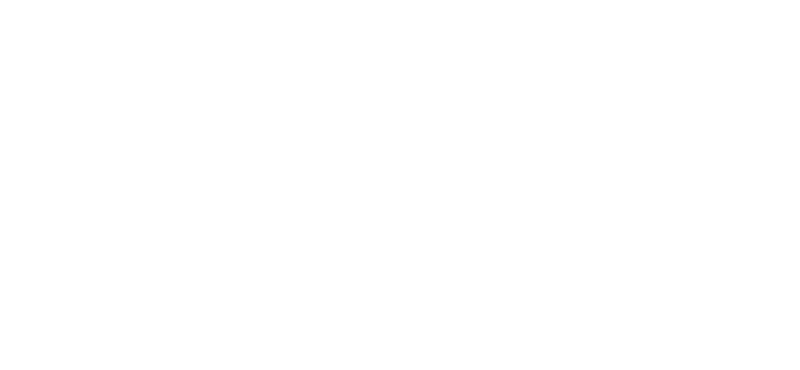
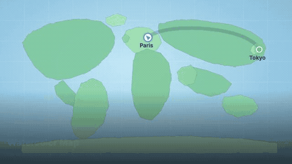

<p align="center">
  
</p>

<p align="center">
  <a href="https://github.com/xAmirHamza77/rokmotion"></a>
  <a href="https://youtu.be/FccxpsBw6S0"></a>
  <a href="https://github.com/xAmirHamza77/rokmotion"></a>
  
</p>

---

## Created with Rokmotion

Programmatic videos for every use case — music visuals, shorts, code animation, campaigns, and more. All previews rendered with Rokmotion.

<table>
<tr>
<td width="33%" align="center" valign="top">

<br>
<strong>Paper Craft</strong><br>
<sub>Cutout layers · sticky notes · tape</sub><br>
<a href="src/showcase/ShowcaseSamples.tsx">Source</a>

</td>
<td width="33%" align="center" valign="top">

<br>
<strong>Neon Grid</strong><br>
<sub>Cyberpunk glow · perspective depth</sub><br>
<a href="src/showcase/ShowcaseSamples.tsx">Source</a>

</td>
<td width="33%" align="center" valign="top">

<br>
<strong>Retro Wave</strong><br>
<sub>80s synth · sunset grid · neon</sub><br>
<a href="src/showcase/ShowcaseSamples.tsx">Source</a>

</td>
</tr>
<tr>
<td width="33%" align="center" valign="top">

<br>
<strong>Kinetic Type</strong><br>
<sub>Bold typography · rhythm · sync</sub><br>
<a href="src/showcase/ShowcaseSamples.tsx">Source</a>

</td>
<td width="33%" align="center" valign="top">

<br>
<strong>Data Viz</strong><br>
<sub>Live charts · gradients · metrics</sub><br>
<a href="src/showcase/ShowcaseSamples.tsx">Source</a>

</td>
<td width="33%" align="center" valign="top">

<br>
<strong>Glass UI</strong><br>
<sub>Frosted panels · depth · motion</sub><br>
<a href="src/showcase/ShowcaseSamples.tsx">Source</a>

</td>
</tr>
<tr>
<td width="33%" align="center" valign="top">

<br>
<strong>Banger Show</strong><br>
<sub>High quality music visuals without learning 3D</sub><br>
<a href="src/showcase/ShowcaseExtended.tsx">Source</a>

</td>
<td width="33%" align="center" valign="top">

<br>
<strong>Submagic</strong><br>
<sub>Captions, B-Rolls, Zooms and Sound Effects</sub><br>
<a href="src/showcase/ShowcaseExtended.tsx">Source</a>

</td>
<td width="33%" align="center" valign="top">

<br>
<strong>Hackreels</strong><br>
<sub>Animate your code in seconds</sub><br>
<a href="src/showcase/ShowcaseExtended.tsx">Source</a>

</td>
</tr>
<tr>
<td width="33%" align="center" valign="top">

<br>
<strong>GitHub Unwrapped</strong><br>
<sub>Personalized year-in-review campaign</sub><br>
<a href="src/showcase/ShowcaseExtended.tsx">Source</a>

</td>
<td width="33%" align="center" valign="top">

<br>
<strong>Vibrantsnap</strong><br>
<sub>Product demos with auto layouts & 4K export</sub><br>
<a href="src/showcase/ShowcaseExtended.tsx">Source</a>

</td>
<td width="33%" align="center" valign="top">

<br>
<strong>AdmoveAI</strong><br>
<sub>Automated eCommerce ad campaigns</sub><br>
<a href="src/showcase/ShowcaseExtended.tsx">Source</a>

</td>
</tr>
<tr>
<td width="33%" align="center" valign="top">

<br>
<strong>MyKaraoke</strong><br>
<sub>Karaoke & lyric videos with AI vocal removal</sub><br>
<a href="src/showcase/ShowcaseExtended.tsx">Source</a>

</td>
<td width="33%" align="center" valign="top">

<br>
<strong>Watercolor Map</strong><br>
<sub>Travel animation with watercolor effects</sub><br>
<a href="src/showcase/ShowcaseExtended.tsx">Source</a>

</td>
<td width="33%" align="center" valign="top">

<br>
<strong>Hello Météo</strong><br>
<sub>Daily weather report generator</sub><br>
<a href="src/showcase/ShowcaseExtended.tsx">Source</a>

</td>
</tr>
<tr>
<td width="33%" align="center" valign="top">

<br>
<strong>Relay.app</strong><br>
<sub>Programmatic instructional videos</sub><br>
<a href="src/showcase/ShowcaseExtended.tsx">Source</a>

</td>
<td width="33%" align="center" valign="top">

<br>
<strong>MUX</strong><br>
<sub>Dynamic animated video stats</sub><br>
<a href="src/showcase/ShowcaseExtended.tsx">Source</a>

</td>
<td width="33%" align="center" valign="top">

<br>
<strong>AnimStats</strong><br>
<sub>Statistics into animated GIFs & videos</sub><br>
<a href="src/showcase/ShowcaseExtended.tsx">Source</a>

</td>
</tr>
<tr>
<td width="33%" align="center" valign="top">

<br>
<strong>Fluidmotion</strong><br>
<sub>Animated backgrounds for apps & videos</sub><br>
<a href="src/showcase/ShowcaseExtended.tsx">Source</a>

</td>
<td width="33%" align="center" valign="top">

<br>
<strong>Rokmotion Recorder</strong><br>
<sub>Screen recording built with Rokmotion</sub><br>
<a href="src/showcase/ShowcaseExtended.tsx">Source</a>

</td>
<td width="33%" align="center" valign="top">

<br>
<strong>Next.js</strong><br>
<sub>Visual video tutorials for developers</sub><br>
<a href="src/showcase/ShowcaseExtended.tsx">Source</a>

</td>
</tr>
<tr>
<td width="33%" align="center" valign="top">

<br>
<strong>Electricity Maps</strong><br>
<sub>Heavy electricity data visualization</sub><br>
<a href="src/showcase/ShowcaseExtended.tsx">Source</a>

</td>
<td width="33%" align="center" valign="top">

<br>
<strong>Revid</strong><br>
<sub>AI-powered storytelling social videos</sub><br>
<a href="src/showcase/ShowcaseExtended.tsx">Source</a>

</td>
<td width="33%" align="center" valign="top">

<br>
<strong>SuperMotion</strong><br>
<sub>Product promo videos from screen recordings</sub><br>
<a href="src/showcase/ShowcaseExtended.tsx">Source</a>

</td>
</tr>
</table>

<p align="center">
  <a href="https://youtu.be/FccxpsBw6S0"><strong>▶ Watch full 30s demo on YouTube</strong></a>
  &nbsp;·&nbsp;
  <a href="demos/PaperRokmotionStart-demo.mp4">Download MP4</a>
  &nbsp;·&nbsp;
  <a href="src/showcase/registry.ts">All showcase source</a>
</p>
---

Rokmotion is an open-source **video creation tool** that turns text prompts into polished MP4 videos — tutorials, promos, paper animations, and enhanced edits of your existing footage. Use it in Grok with `/rokmotion`.

<table>
<tr>
<td width="50%">

### What you get

- Paper-style & motion-graphics templates
- **3 creation modes** (voiceover, AI script, video-to-video)
- ElevenLabs sync with auto scene timing
- Picture-in-picture overlays (box or circle)
- Full render pipeline via CLI

</td>
<td width="50%">

### Built with

| Tool | Role |
|------|------|
| Rokmotion CLI | React → video engine |
| [Grok](https://x.ai) | `/rokmotion` AI skill |
| [ElevenLabs](https://elevenlabs.io) | AI narration (optional) |
| Node.js + TypeScript | Project runtime |

</td>
</tr>
</table>

---

## Watch the demo

**30-second paper-animation tutorial** — learn how to start Rokmotion, with voiceover synced to every scene.

https://www.youtube.com/watch?v=FccxpsBw6S0

<p align="center">
  <a href="https://www.youtube.com/watch?v=FccxpsBw6S0"><strong>▶ Watch on YouTube</strong></a>
  &nbsp;·&nbsp;
  <a href="demos/PaperRokmotionStart-demo.mp4">Download MP4</a>
  &nbsp;·&nbsp;
  <a href="demos/rokmotion-youtube-thumbnail.png">Thumbnail</a>
</p>

<details open>
<summary><strong>Video chapters</strong></summary>

| Time | Scene | What happens |
|:----:|-------|----------------|
| 0:00 | **Intro** | "Start Rokmotion" — paper cutout title card |
| 0:04 | **Step 1** | Type `/rokmotion` to launch |
| 0:08 | **Step 2** | Describe your video (style, length, format) |
| 0:14 | **Step 3** | Rokmotion builds your scenes |
| 0:19 | **Step 4** | ElevenLabs voiceover syncs to scene timing |
| 0:24 | **Step 5** | Render your final MP4 |

</details>

<details>
<summary><strong>What this demo was built with</strong></summary>

- Composition: `PaperRokmotionStart` (1920×1080, 30 fps)
- Style: Kraft paper, sticky notes, cutout layers
- Audio: ElevenLabs TTS with word-alignment scene sync
- Render: `npx rokmotion render PaperRokmotionStart out/video.mp4`

</details>

---

## Prerequisites

- **Node.js 18+** — [nodejs.org](https://nodejs.org)
- **npm** (comes with Node)
- **ffmpeg** (optional) — for video-to-video audio extraction and duration probing
- **Grok** with the `rokmotion` skill installed at `~/.grok/skills/rokmotion/`
- **ElevenLabs API key** (Mode 2 only) — free tier works with default voice

---

## Installation

### 1. Clone the repo

```bash
git clone https://github.com/xAmirHamza77/rokmotion.git
cd rokmotion
```

### 2. Install dependencies

```bash
npm install
```

First run downloads the render engine and Chrome Headless Shell for rendering (~100 MB).

### 3. Configure environment (Mode 2 only)

```bash
cp .env.example .env
```

Edit `.env` and add your ElevenLabs key:

```
ELEVENLABS_API_KEY=your_key_here
```

Get a key at [elevenlabs.io](https://elevenlabs.io). **Never commit `.env`** — it is gitignored.

### 4. Verify setup

```bash
npm run dev
```

Opens Rokmotion Studio at **http://localhost:3000**. You should see all compositions in the sidebar.

```bash
npx rokmotion compositions
```

Lists available video compositions.

---

## How to make videos

When you ask Grok to create a video (`/rokmotion`), it will ask you to pick one of **three modes**:

### Mode 1: User voiceover

You provide a recorded audio file. Grok builds visuals synced to your voice.

```bash
# Import your audio and detect duration
npm run import-assets -- --mode user-voiceover --project myvideo --audio /path/to/voiceover.mp3

# Preview
npm run dev

# Render
npx rokmotion render UserVoiceoverVideo out/myvideo.mp4 \
  --props='{"mode":"user-voiceover","projectId":"myvideo","audioFile":"uploads/myvideo/voiceover.mp3","durationInSeconds":30}'
```

**Best for:** podcasts, personal narration, existing voice recordings.

---

### Mode 2: ElevenLabs + script

Grok writes a narration script. ElevenLabs generates voice. Scenes auto-sync to speech alignment.

```bash
# Test API key
npm run elevenlabs:test

# Generate voiceover + scene timing
npm run voiceover -- PaperRokmotionStart

# Or with custom script:
npm run voiceover -- MyComposition Your full narration script here...

# Render (example: paper tutorial)
npx rokmotion render PaperRokmotionStart out/video.mp4
```

**Auto-generated files:**
- `public/voiceover/<id>/narration.mp3` — audio
- `src/voiceover/<id>.timing.ts` — scene sync from ElevenLabs alignment
- `src/voiceover/<id>.meta.ts` — duration metadata

**Best for:** tutorials, promos, explainers without recording your own voice.

**Free-tier voice:** Bella (`EXAVITQu4vr4xnSDxMaL`). Override with `ELEVENLABS_VOICE_ID` in `.env`.

---

### Mode 3: Video to video

Provide a source video. Keep original audio. Add animated overlay scenes where needed.

```bash
# Import source video + generate starter scene plan
npm run import-assets -- --mode video-to-video --project myedit --video /path/to/source.mp4

# Edit scene plan — set source vs animated segments
# File: public/uploads/myedit/scene-plan.json

# Render
npx rokmotion render VideoToVideoEnhance out/myedit.mp4 \
  --props='{"mode":"video-to-video","projectId":"myedit","sourceVideo":"uploads/myedit/source.mp4","audioFile":"uploads/myedit/source-audio.mp3","scenePlan":{...}}'
```

**Scene behavior:**
| Type | What happens |
|------|----------------|
| `source` | Full user video visible, original audio plays |
| `animated` | Full video hidden; animated overlay shown; user video in PiP (box/circle) if enabled |

**PiP options** in `scene-plan.json`:
- `shape`: `"box"` or `"circle"`
- `position`: `"bottom-right"`, `"bottom-left"`, `"top-right"`, `"top-left"`
- `pip.enabled: false` — fully hide user video during animated scenes

**Best for:** enhancing existing footage, adding motion graphics to talking-head videos.

---

## Available compositions

| Composition ID | Description | Mode |
|----------------|-------------|------|
| `PaperRokmotionStart` | Paper-animation "how to start" tutorial (demo video) | 2 |
| `RokmotionTutorial` | Dark motion-graphics tutorial | 2 |
| `UserVoiceoverVideo` | Template for user-provided audio | 1 |
| `VideoToVideoEnhance` | Template for video editing + overlays | 3 |

---

## Quick start — recreate the demo video

```bash
git clone https://github.com/xAmirHamza77/rokmotion.git
cd rokmotion
npm install
cp .env.example .env          # add ElevenLabs key
npm run voiceover -- PaperRokmotionStart
npx rokmotion render PaperRokmotionStart out/PaperRokmotionStart.mp4
```

Output: `out/PaperRokmotionStart.mp4` (~30s, 1920×1080).

---

## Grok skill

Install the skill so Grok auto-invokes Rokmotion when you ask for videos:

The skill lives at `~/.grok/skills/rokmotion/SKILL.md` (user scope).

**Slash command:** `/rokmotion make a 30s tutorial video`

Grok will ask which mode you want, gather assets, write compositions, and render.

---

## Project structure

```
rokmotion/
├── demos/                    # Demo videos (committed to GitHub)
├── src/
│   ├── PaperRokmotionStart.tsx   # Paper-animation tutorial
│   ├── RokmotionTutorial.tsx     # Motion graphics tutorial
│   ├── UserVoiceoverVideo.tsx    # Mode 1 template
│   ├── VideoToVideoEnhance.tsx   # Mode 3 template
│   ├── components/UserVideoPiP.tsx
│   ├── voiceover/                # Auto-generated timing + metadata
│   └── calculate-metadata/       # Dynamic duration from audio
├── scripts/
│   ├── elevenlabs/           # TTS generation + alignment sync
│   └── import-assets.ts      # Import user audio/video
├── public/uploads/           # User assets (gitignored)
├── public/voiceover/         # Generated narration (gitignored)
└── out/                      # Rendered videos (gitignored)
```

---

## Common commands

```bash
npm run dev                    # Preview in Rokmotion Studio
npm run render                 # Render (pass composition ID)
npm run voiceover -- <id>      # Generate ElevenLabs narration
npm run import-assets -- ...   # Import user audio or video
npm run elevenlabs:test        # Verify ElevenLabs API
npx rokmotion compositions      # List compositions
npx tsc --noEmit               # Typecheck
```

---

## Troubleshooting

| Problem | Fix |
|---------|-----|
| Blank video output | Check composition returns visible content |
| ElevenLabs 402 error | Use free-tier voice Bella, or upgrade plan |
| `ELEVENLABS_API_KEY` missing | Copy `.env.example` to `.env` and add key |
| Render slow first time | Chrome Headless Shell downloads on first render |
| ffmpeg not found | Install ffmpeg for video-to-video audio extraction |

---

## License

Rokmotion is open source. See the [GitHub repo](https://github.com/xAmirHamza77/rokmotion) for source and license terms.